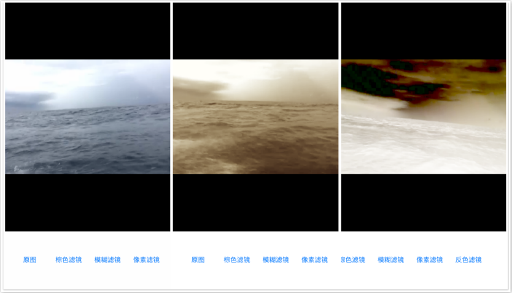

# BCVideoFilter

[]()

## 描述

视频滤镜

## 截图



## 用法

```objc
	// 初始化
   BCVideoFilter *videoFilter = [[BCVideoFilter alloc] initWithFrame:self.displayView.bounds videoInputUrl:url];
    // 设置显示层
    [self.displayView addSubview: videoFilter.view];
    // 设置滤镜
    BCSepiaToneFilter *filter = [[BCSepiaToneFilter alloc] init];
    [videoFilter addFilter:filter];
    // 开始滤镜过滤
    [videoFilter processVideoWithBlockCompletionHandler:^(float progress, BOOL isFinish, NSError *error) {
        ...
    }];

```

### 自定义滤镜

在 `filters` 文件夹下，添加一个自定义的类，并重写 `- (CIImage *)getFilterHanldeImage:(CIImage *)image` 方法，在方法中可以添加自定义的滤镜，在 `VC` 中实例化并使用 `addFilter` 方法就可以实现自定义滤镜。

## License

BCVideoFilter is under the MIT license.